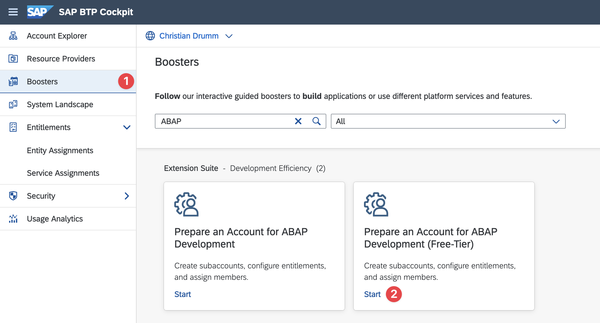
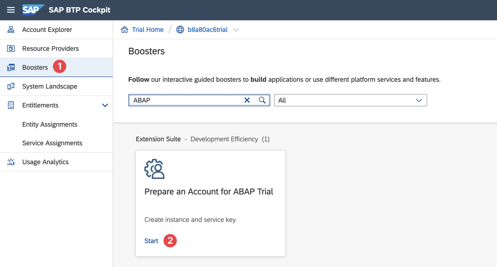
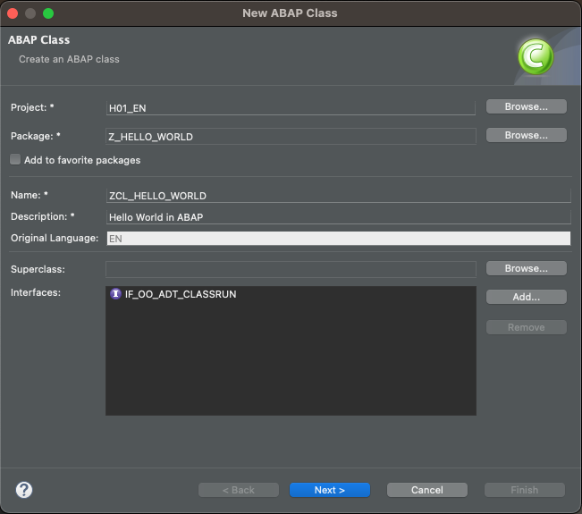
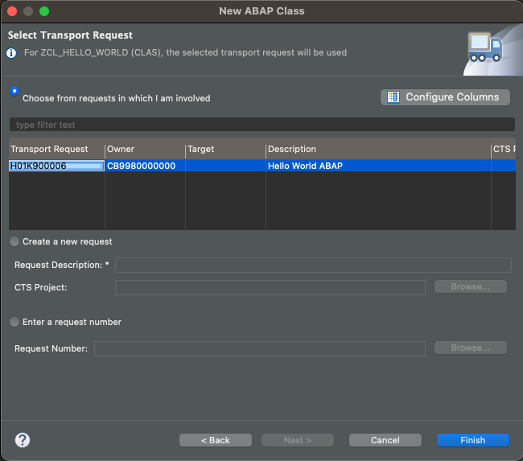
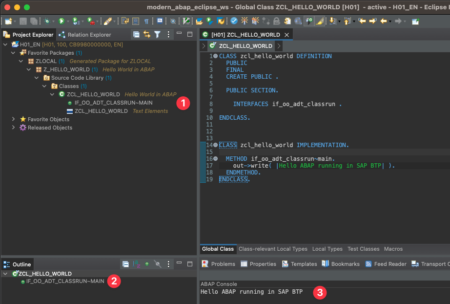

# ABAP Hello World

The goal of this lecture is set up the necessary development environment for ABAP development.
This development environment consists of several components. The following sections provide links
to documents describing the installation or set-up of theses components.

The aim of this unit is to set up the necessary development environment for ABAP
development. This environment consists of several components, which are described
in the following sections. In particular, the development environment for the rest
of the lecture includes:

- a local installation of the [Eclipse IDE](https://www.eclipse.org/ide/) including the
  [ABAP Development Tools](https://tools.hana.ondemand.com/#abap) for ABAP development
- either one of the following three options
  - a S/4HANA 2020 System with development rights
  - an instance of the [SAP Business Technology Platform](https://www.sap.com/products/technology-platform/)
    free tier with an instance of the [SAP BTP ABAP environment](https://discovery-center.cloud.sap/serviceCatalog/abap-environment?region=all&tab=feature&commercialModel=payg)
  - a SAP Business Technology Platform trial account with access to the SAP BTP ABAP Trial environment

At the end of this unit you will create the usual [Hello World](https://en.wikipedia.org/wiki/%22Hello,_World!%22_program)
program to ensure the development environment is ready.

## Installing Eclipse and the ABAP Development Tools

The first step in setting up the development environment is to install the Eclipse
IDE. There are several possible options to do this: you can download the
[Eclipse Installer](https://www.eclipse.org/downloads/) and execute it, or install the suitable
[package](https://www.eclipse.org/downloads/packages/) for your system. On macOS
and Linux, you can also use a package manager like [Homebrew](https://brew.sh/) or
[APT](<https://en.wikipedia.org/wiki/APT_(software)>).

Once the Eclipse IDE is installed, you need to add the ABAP Developer Tools plug-ins. Follow these steps:

1. Inside the Eclipse IDE open the `Help` menu and select `Install New Software...`
1. Enter the following URL `https://tools.hana.ondemand.com/latest` and press `<Enter>`
   to display the available features.
1. Select `ABAP Development Tools` and install them.

Once the installation is complete, restart the Eclipse IDE. After the restart, the
Eclipse IDE should display a Welcome page similar to the one in the following image.
If the installation was successful, you should see an "ABAP Development Tools"
entry on the Welcome page. Note that the Welcome page can always be accessed via
the Help menu (`Help > Welcome`).


## SAP BTP Free Tier and SAP BTP Trial

To deploy the SAP Business Technology Platform ABAP Environment in the next step,
you need an account in the SAP Business Technology Platform (BTP).
Currently, the SAP BTP offers two possibilities to get a free account:

- SAP BTP Free Tier
- SAP BTP trial account.

The SAP BTP free tier is a productive SAP BTP account with no costs, while the SAP
BTP trial account is a SAP BTP account with limited functionality. The following
table lists some of the advantages and disadvantages of the different environments.

|                                        | Free Tier | Trial Account |
| :------------------------------------- | :-------: | :-----------: |
| Credit Card required                   |    Yes    |      No       |
| All services available                 |    Yes    |      No       |
| Shared ABAP Environment                |    No     |      Yes      |
| Production ready environment           |    Yes    |      No       |
| Risk of activating chargeable services |    Yes    |      No       |
| Limited availability (90 days)         |    No     |      Yes      |

To sign up for the SAP BTP free tier, follow the steps in
[this tutorial](https://developers.sap.com/tutorials/btp-free-tier-account.html).
Note that signing up requires a credit card for authentication.

To sign up for an SAP BTP trial account, follow the steps in
[this tutorial](https://developers.sap.com/tutorials/hcp-create-trial-account.html).
No credit card is required for this process.

### Deploying the SAP BTP ABAP Environment in SAP BTP Free Tier

Deploying the SAP BTP ABAP environment is similar for both, the SAP BTP free tier and
the SAP BTP trial. In both cases a _Booster_ is available to deploy the ABAP
environment. A Booster is simply a wizard or script that executes the necessary
set up steps in the SAP BTP.

The respective Booster can be accessed from the SAP BTP Cockpit. The SAP BTP
Cockpit is available at the following URLs:

- SAP BTP Free Tier: https://account.hana.ondemand.com/
- SAP BTP Trial: https://account.hanatrial.ondemand.com/trial/

In the SAP BTP free tier the Booster is named _Prepare an Account for ABAP
Development (Free-Tier)_ (cf. the following screen shot).



In the SAP BTP trial the Booster is named _Prepare an Account for ABAP Trial_
(cf. the following screen shot).



Select the suitable ABAP Booster and execute it. After the booster is finished the
SAP BTP account is prepared for ABAP development. The booster created a new
subaccount in the global account. The instances and subscriptions in this
subaccount should look similar to the following screenshot. Note, that the
names of the subaccount, the instance and the environment might differ
depending on the parameters used in the booster.


#### Possible Errors

**Error creating service instance**
In some cases, the creation of the service instance may fail, resulting in either
an empty instance or an error message displayed in the sub-account.


If this happens the erroneous environment can be deleted and created again using the _Create_ button.
In the instance creation dialogue select _ABAP environment_ as Service and _free_ as the used Plan and
choose a name for the instance. In the second step of the dialogue add the email address of the user.
Finally, click _Create_ to create the service.

If this occurs, the erroneous environment can be deleted and re-created by clicking
on the `Create` button. In the instance creation dialog box, select _ABAP environment_
as the service, _free_ as the plan used, and choose a name for the instance. In the
second step of the dialog box, add the email address of the user and click on _Create_
to create the service.

**Missing Authorizations**

If the instance is created manually it is also necessary to assign the development role to the
default user (CB_ADMIN) of the ABAP instance. The necessary steps are described
[here](https://help.sap.com/docs/BTP/65de2977205c403bbc107264b8eccf4b/13b2cfb49c8046d8a031e137b6142127.html).

## ABAP Hello World

Once the ABAP environment is ready, the next step is to write the "Hello World" program.
To do this, the first step is to connect the ABAP Development to Eclipse to the ABAP
environment. Depending on the type of environment (SAP S/4HANA or SAP BTP) different options exist.
In case of the SAP BTP ABAP environment the easiest way is
to use the service key of ABAP environment.

To find the service key in the sub-account, go to the ABAP environment instance.
If there is no service key available, create one by clicking on the `Create` button.
To view the service key, click on `View`. In this dialog box, the service key can
be copied in JSON format.


### Connect Eclipse to the ABAP environment

To connect Eclipse to the ABAP environment, open the ABAP perspective (using the
menu `Window > Perspective > Open Perspective > Other...`). In the ABAP perspective,
click on the `Create an ABAP cloud project` in the Project Explorer view. In the
_New ABAP Cloud Project_ window, select _SAP BTP ABAP Environment_ and _Using a Service
Key_ and click on `Next`. Paste the service key into the text field _Service Key in
JSON Format_ and click on `Next`. To log in, click on `Open Logon Page in Browser`. After
the login is successful, click on `Finish` to complete the connection. The ABAP perspective
should look similar to the following screenshot.


### ABAP Hello World

After the connection to the ABAP environment is established the next step is to write the ABAP Hello World program.
In order to do this the first step is to create a [package](https://help.sap.com/docs/SAP_S4HANA_CLOUD/25cf71e63940453397a32dc2b7676947/4ec14bab6e391014adc9fffe4e204223.html?locale=en-US&q=abap%20package).
The first package named `ZLOCAL` is already created in the ABAP environment, but it is a [structure package](https://help.sap.com/docs/SAP_S4HANA_CLOUD/25cf71e63940453397a32dc2b7676947/4ec14bab6e391014adc9fffe4e204223.html?locale=en-US&q=abap%20package#types).
According to the SAP documentation a structure package:

> is the root container of a package hierarchy that defines the basic architecture of an application.
> ...
> Structure packages cannot contain any development objects except their own package interfaces and sub-packages.

As a structure package can not contain any development objects except other packages, the first step
is to create a package for the Hello World program. In order to create a new package right click on
the `ZLOCAL` package and select _New > ABAP Package_. This opens a dialogue to create
a new package.

As a structure package cannot contain any development objects except its own package
interfaces and sub-packages, the first step is to create a new package for the Hello
World program. To create a new package, right-click on the `ZLOCAL` package and select
`New > ABAP Package`. This opens a dialog box to create a new package.

In this dialogue enter `Z_HELLO_WORLD` as the package name and `ABAP Hello World` as the description. Click on `Next`.
This open the _Select Transport Request_ view. Chose _Create Transport Request_, enter `ABAP Hello World` as the
_Request Description_ and click `Finish`. This creates the package `Z_HELLO_WORLD` as a sub-package of `Z_LOCAL`.


> **Note on SAP BTP Trial**
> As mentioned above the SAP BTP Trial offers a shared ABAP environment. In a shared environment the
> names used for different development artefacts might not be available any more.
> In this cases it is necessary to use and individual prefix for all development artefacts to
> naming conflicts. For example, instead of `Z_HELLO_WORLD` and `ZCL_HELLO_WORLD` you could use
> your initials as prefixes. My initials are CD. The objects would therefore be named `Z_CD_HELLO_WORLD` and `ZCL_CD_HELLO_WORLD`.

Now a class needs to be created in this package. To create the class right click on
the `Z_HELLO_WORLD` package and select `New > ABAP Class`. This again opens a dialogue to create
a new class.

In this dialogue enter `ZCL_HELLO_WORLD` as the class name and `ABAP Hello World` as the description.
In order for a ABAP class to be executable in the SAP BTP, the class needs to
implement the [`IF_OO_ADT_CLASSRUN`](https://help.sap.com/docs/SAP_S4HANA_CLOUD/6aa39f1ac05441e5a23f484f31e477e7/6f0e26492b854627ac19a9a34205a546.html?locale=en-US) interface.
This interface can be added either in the source code later on or in the current dialogue using the `Add` button.



Click on `Next` and assign the class to the transport request created in the previous step. Finally, click on finish to create the class.



After the creation the class should automagically be opened in the source code editor.
Add the following code to the `if_oo_adt_classrun~main` method:

```ABAP
out->write( |Hello ABAP running in SAP BTP| ).
```

This code uses the `write` method of the `out` interface to set the output of the program. The complete source code of the `zcl_hello_world` is shown below.

```abap
CLASS zcl_hello_world DEFINITION
  PUBLIC
  CREATE PUBLIC .

  PUBLIC SECTION.
    INTERFACES if_oo_adt_classrun .
ENDCLASS.


CLASS zcl_hello_world IMPLEMENTATION.

  METHOD if_oo_adt_classrun~main.
    out->write( |Hello ABAP running in SAP BTP| ).
  ENDMETHOD.
ENDCLASS.
```

To execute the class, you need to activate it first by clicking on the 
button or navigating to `Edit > Activate` in the menu. Once the class has been activated,
you can run it by selecting `Run > Run As > ABAP Application (Console)` or simply
pressing the `<F9>` key. If everything is working correctly, the output should resemble
the screenshot below.



Congratulations! You have now created and successfully executed an ABAP Hello World program.

## References

- [DSAG ADT Leitfaden - ABAP in modern](https://1dsag.github.io/ADT-Leitfaden/)

---

[Next Chapter >](./abap_rap.md) | [Overview 🏠](../README.md)
