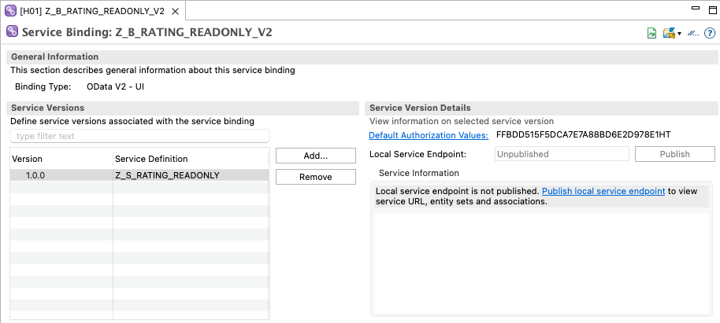
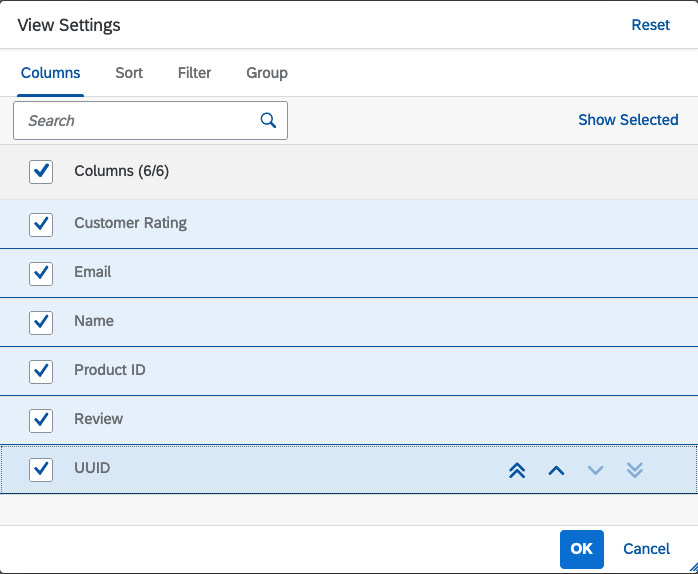
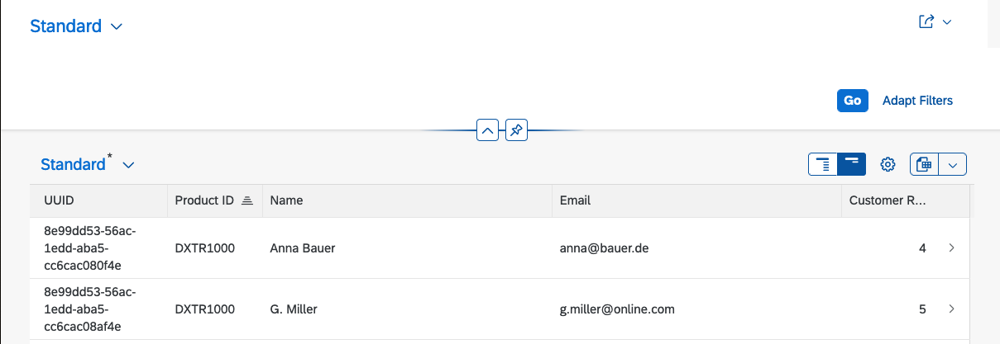

# Creating a Read-Only List Report

With the data model in place the next step is to create a read-only list report.
A read-only list report enables displaying the data of the business objects using a
Fiori-App. In this unit a read-only list report is created for the `Z_C_Rating_ReadOnly` entity.
The Fiori-App is implemented using the [SAP Fiori elements](https://experience.sap.com/fiori-design-web/smart-templates/)
framework.

## The Business Service Provisioning Layer

The following figure shows the components of the ABAP RAP again.
In the figure the _Business Service Provisioning_ layer separates
the business objects from the service consumption.


The business service provisioning layer contains two types of entities:

- Service Definition
- Service Binding.

The role of the _service definition_ is to specify which business objects of the data model
are exposed. In particular,
different service definitions can be created for the same
business object to cater for different consumption scenarios.

The _service binding_ binds a service (defined in a service definition) to a specific communication
protocol. Examples of available bindings are OData V2 and OData V4. Again, it is possible to create
different service bindings for different service definitions.

## Creating a Service Definition and a Service Binding

To create a service definition for the `Z_C_Rating_ReadOnly` entity,
right click on the entity and select `New Service Definition`.


In the dialogue enter `Z_S_RATING_READONLY` as the name of the service definition and
`Service for Read-Only UI` as the description. In the next screen select a transport request and
click `Next>`. In the templates screen select the `Define Service`template and click `Finish`.

Below is the code of the service definition.

```abap
@EndUserText.label: 'Service for Read Only UI'
define service Z_S_Rating_ReadOnly {
  expose Z_C_Rating_ReadOnly;
  expose Z_C_Product_ReadOnly;
}
```

The service [exposes](https://help.sap.com/doc/abapdocu_latest_index_htm/latest/en-US/index.htm?file=abensrvd_define_service.htm)
two entities from the data model, `Z_C_Rating_ReadOnly` and `Z_C_Product_ReadOnly`.

To create a service binding for the service definition, right click on the `Z_S_RATING_READONLY` service and
select `New Service Binding`.
In the dialogue enter `Z_B_RATING_READONLY_V2` as the name of the service definition and
`Rating Service - UI V2` as the description. As the binding type select `OData V2 - UI`. In the next screen select a transport request and
click `Finish` and activate the binding.

The resulting binding is shown in the following screenshot.



Note that after creating a service binding, the service in not published, yet. This means that the
service can not be accessed. To publish the service click on the `Publish local service endpoint` link. This
generates the necessary artefacts for the service to be accessible. Once the publishing has completed active
the service again.

Publishing the service results in two changes in the service binging:

- A `Service URL` is shown in the binding
- The `Preview` button becomes active.


Clicking on the `Service URL` opens the created OData service in the browser. It is now already possible
to query this service using the OData protocol.

### Exercise 1

Read the example data from the database using the OData service. Try to read rating and product data. Try to filter the
returned data e.g. only read reviews for a certain product.

### Different Service Binding Protocol Options

When creating a service binding different protocol options are available. The
[SAP documentation](https://help.sap.com/docs/btp/sap-abap-restful-application-programming-model/service-binding)
contains the following recommendations when to use which option:

> **UI service**
>
> A UI service makes it possible to add a SAP Fiori elements UI or other UI clients to the service.
> Currently, UI services are supported for OData and InA services.
>
> **Web API**
>
> A service that is exposed as Web API is used for all other use cases apart from UIs. Web APIs can be consumed by an unknown consumer via OData. Web APIs can be extended.
> Currently, Web APIs are supported for OData and SQL services.

Whether to use OData v2 or OData v4 depends also on the focus of the service. Regarding OData v4 the SAP documentation states:

> OData V4 services have a wider scope than OData V2 services. Use OData V4 wherever possible for transactional services.

However, not all features of SAP Fiori elements are available for OData v2. Therefore the OData v2 option is used in this unit.

### Previewing the Service

With the service published, it is now possible to preview the data using Fiori Elements.
The screenshot below shows the result of executing the preview for `Z_C_Rating_ReadOnly`.


The preview does not show any data. The reason is, that currently no definition exists which data of the
entity should be displayed and which not. In one of the subsequent steps this information is added to the CDS view
defining the entity. Until then it is possible to manually select the data to be displayed. This is done by clicking on the
gear icon. This opens the `View Settings` dialog. Here the columns to display can be selected.



Selecting all available columns and also sorting the table by `Product ID` results in the data being displayed as shown below.



Note that the Fiori elements app already provides a number of nice features. For example, it is possible to
resize the columns, to change the sort order and filtering by clicking on the column header or an export to MS Excel.

## Adding UI Annotations

As mentioned before the Fiori App in this tutorial is build using they
[SAP Fiori elements](https://experience.sap.com/fiori-design-web/smart-templates/) framework. This framework offers
different floorplans to create apps for different use cases. Currently SAP Fiori Elements offers the following floorplans:

- List Report
- Work list
- Object Page
- Overview Page
- Analytics List Page.

Examples of the different floorplans are shown [here](https://experience.sap.com/fiori-design-web/smart-templates/#supported-floorplans).
In this unit a read-only list report to display the rating data is developed. Consequently, the list report floorplan is the basis for this app.

Each of the different SAP Fiori elements floorplans offers a large number of features. Identifying the correct feature
to implement a certain requirement is sometimes not easy. Fortunately SAP create the
[SAP Fiori Element Feature Showcase App](https://github.com/SAP-samples/abap-platform-fiori-feature-showcase). This app
shows all the available features and also provides code examples for their usage. Furthermore, the
[Wiki of the Feature Showcase App](https://github.com/SAP-samples/abap-platform-fiori-feature-showcase/wiki/Feature-Showcase-App-Guide) offers
a very useful search functionality.

In the following sections different features are added to the read-only list report using CDS annotations.

### Defining Search Result Columns

In the current state it is necessary to add the displayed columns to the list report manually each time the app preview is started.
The first step is to define which columns are displayed in the search result table.
To add a field of a CDS view as a column to the search result table the `@UI.lineItem` annotation can be used.
With `@UI.lineItem.position` the position of the column can be defined. `@UI.lineItem.label` defines the label of the column.
`@UI.lineItem.importance` defines which columns are less and which are more important. The less important columns are
hidden first if the app is opened on a smaller screen e.g. a mobile phone. Finally `@UI.lineItem.type` defines the column is displayed.
Possible values are `#STANDARD` for normal values or `#WITH_URL` if the column contains a external link.

The following listings show two variants of annotating the `Product` field with position 10, importance high and type `#STANDARD`.
Note, that the code completion in the ABAP in Eclipse is very useful to create those annotations.

```abap
@UI.lineItem.position: 10
@UI.lineItem.label: 'Product'
@UI.lineItem.importance = #HIGH
@UI.lineItem.type = #STANDARD
Product
```

```abap
@UI:{
  lineItem: [{
    position: 10,
    importance: #HIGH,
    type: #STANDARD,
    label: 'Product'
  }]
}
```

It might also be necessary to hide certain fields in the UI. For example, the `RatingUUID` in this example
is not useful to any user and should therefore been hidden. Hiding a field can be achieved by using the `@UI.hidden: true` annotation.

The listing below shows possible annotations for the fields of the `Z_C_Rating_ReadOnly` view.

```abap

@EndUserText.label: 'Rating view for RO UI'
@AccessControl.authorizationCheck: #NOT_REQUIRED

define root view entity Z_C_Rating_ReadOnly
  as projection on Z_I_Rating
{
    @UI.hidden: true
  key RatingUUID,

      @UI:{
        lineItem: [{
          position: 10,
          importance: #HIGH,
          type: #STANDARD,
          label: 'Product'
        }]
      }
      Product,

     @UI:{
       lineItem: [{
         position: 30,
         importance: #MEDIUM,
         type: #STANDARD,
         label: 'Name'
       }]
      }
      Name,

      @UI:{
        lineItem: [{
          position: 40,
          importance: #MEDIUM,
          type: #STANDARD,
          label: 'E-Mail'
        }]
      }
      Email,

      @UI:{
        lineItem: [{
          position: 20,
          importance: #HIGH,
          type: #STANDARD,
          label: 'Rating'
        }]
      }
      Rating,

      Review,

      /* Associations */
      _Product
}

```

With those annotations the preview of the read-only list report looks like shown the following screenshot.


### Adding Search Capabilities

Currently, the app offers no functionality to search for a certain review other then scrolling though the result list.
In this step search capabilities are added to the list report.

To enable search capabilities for a CDS entity the entity needs to be annotation with `@Search.searchable: true`.

```abap
@Search.searchable: true
define root view entity Z_C_Rating_ReadOnly
...
```

Next, all fields that should be searchable need to be annotated with `@Search.defaultSearchElement: true`. In
addition it is possible to specify a threshold for the required similarity of the results to the search string.
A similarity threshold of 1.0 means that the result and search term are identical.

```abap
...
@Search.defaultSearchElement: true
@Search.fuzzinessThreshold : 0.8
Product,
...
```

Finally, the is is possible to add a dedicated selection field using the `@UI.selectionField.position` annotation. The following listing
shows the resulting CDS entity including the annotations.

```abap
@Search.searchable: true
define root view entity Z_C_Rating_ReadOnly
  as projection on Z_I_Rating
{
      @UI.hidden: true
  key RatingUUID,

      @UI:{
        selectionField: [{position: 10 }],
        lineItem: [{
          position: 10,
          importance: #HIGH,
          type: #STANDARD,
          label: 'Product'
        }]
      }
      @Search.defaultSearchElement: true
      @Search.fuzzinessThreshold : 0.8
      Product,

      @UI:{
        lineItem: [{
          position: 30,
          importance: #MEDIUM,
          type: #STANDARD,
          label: 'Name'
        }]
      }
      @Search.defaultSearchElement: true
      @Search.fuzzinessThreshold : 0.8
      Name,

      @UI:{
        lineItem: [{
          position: 40,
          importance: #MEDIUM,
          type: #STANDARD,
          label: 'E-Mail'
        }]
      }
      @Search.defaultSearchElement: true
      Email,

      @UI:{
        lineItem: [{
          position: 20,
          importance: #HIGH,
          type: #STANDARD,
          label: 'Rating'
        }]
      }
      Rating,

      Review,
      /* Associations */
      _Product
}

```

The following screenshot shows the resulting Fiori App.


#### Exercise 2

Test different search string and different variants of search annotations (e.g. threshold value) to see the effect of these annotations.
Which of the UI adaptation features (e.g. adding and removing result columns or reordering of columns) do still work?

### Adding Object Page Annotations

The current version of the app already allows to navigate to the details of a review.
However, the object page (i.e. the page displaying the details) is currently completely empty. In the next step
annotations are used to add information to the object page.

The `@UI.headerInfo.typeName` and `@UI.headerInfo.typeNamePlural` annotations can be used to add a title to the result table and the
object page.

```abap
@UI: {
 headerInfo: { typeName: 'Rating',
               typeNamePlural: 'Ratings' } }
```

Using `@UI.facet` sub-sections for the object page can be defined. The following code snippet shows the creation of a header and a standard facet.

```abap
 @UI.facet: [ { targetQualifier: 'fRating',
                           purpose:  #HEADER,
                           type:     #IDENTIFICATION_REFERENCE,
                           label:    'Rating',
                           position: 10 },

                           { targetQualifier: 'fCustomer',
                           purpose:  #STANDARD,
                           type:     #IDENTIFICATION_REFERENCE,
                           label:    'Customer',
                           position: 20 }
              }
            ]
```

Using `@UI.identification` annotations, data can be added to these facets. For example, the following snippet shows how the `name` field
can be added to the `fCustomer` facet.

```abap
@UI:{
   ...
      identification: [{
        position: 10,
        label: 'Name',
        qualifier: 'fCustomer'
      }]
    }
    ...
Name
```

Adding addition annotation for the object page to `Z_C_Rating_ReadOnly` results in the following code.

```abap
@EndUserText.label: 'Rating view for RO UI'
@AccessControl.authorizationCheck: #NOT_REQUIRED

@UI: {
 headerInfo: { typeName: 'Rating',
               typeNamePlural: 'Ratings' } }

@Search.searchable: true
define root view entity Z_C_Rating_ReadOnly
  as projection on Z_I_Rating
{
      @UI.facet: [ { targetQualifier: 'fRating',
                     purpose:  #HEADER,
                     type:     #IDENTIFICATION_REFERENCE,
                     label:    'Rating',
                     position: 10 },

                     { targetQualifier: 'fCustomer',
                     purpose:  #STANDARD,
                     type:     #IDENTIFICATION_REFERENCE,
                     label:    'Customer',
                     position: 20 },

                     { targetQualifier: 'fReview',
                     purpose:  #STANDARD,
                     type:     #IDENTIFICATION_REFERENCE,
                     label:    'Review',
                     position: 30 }]

      @UI.hidden: true
  key RatingUUID,

      @UI:{
        selectionField: [{position: 10 }],
        lineItem: [{
          position: 10,
          importance: #HIGH,
          type: #STANDARD,
          label: 'Product'
        }],
        identification: [{
          position: 10,
          label: 'Product',
          qualifier: 'fRating'
        }]
      }
      @Search.defaultSearchElement: true
      @Search.fuzzinessThreshold : 0.8
      Product,

      @UI:{
        lineItem: [{
          position: 30,
          importance: #MEDIUM,
          type: #STANDARD,
          label: 'Name'
        }],
        identification: [{
          position: 10,
          label: 'Name',
          qualifier: 'fCustomer'
        }]
      }
      @Search.defaultSearchElement: true
      @Search.fuzzinessThreshold : 0.8
      Name,

      @UI:{
        lineItem: [{
          position: 40,
          importance: #MEDIUM,
          type: #STANDARD,
          label: 'E-Mail'
        }],
        identification: [{
          position: 20,
          label: 'E-Mail',
          qualifier: 'fCustomer'
        }]
      }
      @Search.defaultSearchElement: true
      Email,

      @UI:{
        lineItem: [{
          position: 20,
          importance: #HIGH,
          type: #STANDARD,
          label: 'Rating'
        }],
        identification: [{
          position: 20,
          label: 'Rating',
          qualifier: 'fRating'
        }]
      }
      Rating,

      @UI:{

        identification: [{
          position: 10,
          label: 'Detailed Review',
          qualifier: 'fReview'
        }]
      }

      Review,
      /* Associations */
      _Product
}
```

The resulting object page for a rating is shown in the following screenshot.


### Beautifying the App

The last step is to display the customer rating of a product not as a number but as a rating indicator with little stars. A rating of 3 should
be displayed as three stars, a rating of 5 as five stars.
Doing this requires two steps :

1. Definition of a data point
1. Referencing the data point.

First, the start rating should be displayed in the search result table of the list view. The data point for the `Rating` field is created using the
following code. This creates a data point that is displayed as a rating. The maximum possible value of the rating is 5. And the data point is
created for the `Rating` field (`qualifier: 'Rating').

```abap
@UI:{
  ...
  dataPoint: {
    qualifier: 'Rating',
    targetValue: 5,
    visualization: #RATING
  }
}
Rating,
...
```

After adding this the data point annotation the result table of the list report is displayed as shown in the following screenshot.


## Extracting Metadata

## References

- [SAP Fiori Element Feature Showcase App for the ABAP RESTful Application Programming Model](https://github.com/SAP-samples/abap-platform-fiori-feature-showcase)
- [Searchable Wiki of the Feature Showcase App](https://github.com/SAP-samples/abap-platform-fiori-feature-showcase/wiki/Feature-Showcase-App-Guide)
