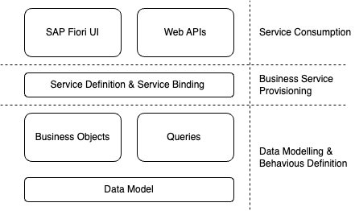

# Creating a Read-Only List Report

With the data model in place the next step is to create a read-only list report.
A read-only list report enables displaying the data of the business objects using a
Fiori-App. In this unit a read-only list report is created for the `Z_C_Rating_ReadOnly` entity.
The Fiori-App is implemented using the [SAP Fiori elements](https://experience.sap.com/fiori-design-web/smart-templates/)
framework.

## The Business Service Provisioning Layer

The following figure shows the components of the ABAP RAP again.
In the figure the _Business Service Provisioning_ layer separates
the business objects from the service consumption.



The business service provisioning layer contains two types of entities:

- Service Definition
- Service Binding.

The role of the _service definition_ is to specify which business objects of the data model
are exposed. In particular,
different service definitions can be created for the same
business object to cater for different consumption scenarios.

The _service binding_ binds a service (defined in a service definition) to a specific communication
protocol. Examples of available bindings are OData V2 and OData V4. Again, it is possible to create
different service bindings for different service definitions.

## Creating a Service Definition and a Service Binding

To create a service definition for the `Z_C_Rating_ReadOnly` entity,
right click on the entity and select `New Service Definition`.


In the dialogue enter `Z_S_RATING_READONLY` as the name of the service definition and
`Service for Read-Only UI` as the description. In the next screen select a transport request and
click `Next>`. In the templates screen select the `Define Service`template and click `Finish`.

Below is the code of the service definition.

```abap
@EndUserText.label: 'Service for Read Only UI'
define service Z_S_Rating_ReadOnly {
  expose Z_C_Rating_ReadOnly;
  expose Z_C_Product_ReadOnly;
}
```

The service [exposes](https://help.sap.com/doc/abapdocu_latest_index_htm/latest/en-US/index.htm?file=abensrvd_define_service.htm)
two entities from the data model, `Z_C_Rating_ReadOnly` and `Z_C_Product_ReadOnly`.

To create a service binding for the service definition, right click on the `Z_S_RATING_READONLY` service and
select `New Service Binding`.
In the dialogue enter `Z_B_RATING_READONLY_V2` as the name of the service definition and
`Rating Service - UI V2` as the description. As the binding type select `OData V2 - UI`. In the next screen select a transport request and
click `Finish` and activate the binding.

The resulting binding is shown in the following screenshot.


Note that after creating a service binding, the service in not published, yet. This means that the
service can not be accessed. To publish the service click on the `Publish local service endpoint` link. This
generates the necessary artefacts for the service to be accessible. Once the publishing has completed active
the service again.

Publishing the service results in two changes in the service binging:

- A `Service URL` is shown in the binding
- The `Preview` button becomes active.


Clicking on the `Service URL` opens the created OData service in the browser. It is now already possible
to query this service using the OData protocol.

### Exercise 1

Read the example data from the database using the OData service. Try to read rating and product data. Try to filter the
returned data e.g. only read reviews for a certain product.

### Previewing the Service

With the service published, it is now possible to preview the data using Fiori Elements.


