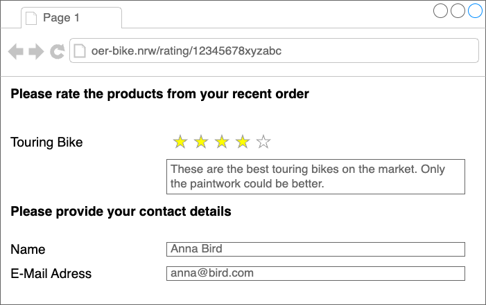
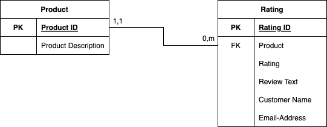

# Scenario Description

This section provides a scenario and business process that serve as the foundation
for this curriculum.

## Customer Rating for Products

OER Bike aims to provide its customers with the opportunity to offer feedback on
products. The feedback should consist of a rating of the product on a scale of 0
to 5, as well as an optional description of the rating. This approach to feedback
is typical of many well-known e-commerce websites. Customers should only be able
to rate products they have ordered.

The following image depicts a possible user interface mockup for customers.

In addition, OER Bike wants to enable product managers for different products to
review the feedback provided by customers. To accomplish this, product managers require
a different user interface. In order to analyze user feedback for a given product,
a product manager enters one of OER Bike's products and receives a list of all
the reviews provided by customers.

The following image depicts a possible user interface mockup for product managers.

OER Bike intends to implement the functionality described above as an extension to its SAP S/4HANA systems.

### Exercise 1

In the previous lecture, you learned about various extension technologies in SAP
S/4HANA. Discuss how the functionality described above could be implemented using
these technologies. What are the advantages and disadvantages of the different approaches?

## Extension Architecture

OER Bike has decided to implement the functionality described above using a custom
application in the SAP BTP ABAP environment, utilizing the RAP framework.
Within OER Bike, the entire project and developed applications are simply referred
to as the _Rating App_.

The data model shown in the following diagram serves as the foundation for the Rating App.

The data model comprises two tables:

- Product: containing the basic information of OER Bike's products
- Rating: containing the customer ratings of the products.

There is a one-to-many relationship between entries in the product table and entries
in the rating table. Therefore, multiple ratings can be stored for each product.

> Note that the data model of the Rating App is very simplistic. Its sole purpose
> is to provide a solid foundation for introducing the RAP framework. In reality,
> the data model of a Rating App would probably be far more complex.

### Exercise 2

1. Discuss which fields are necessary for the tables of the Rating App to provide the described functionality.
1. Analyze the fields of different tables in an SAP S/4HANA system. What fields are
   present there? Would you add additional fields to the tables after the analysis?

---

[< Previous Chapter](./abap_rap.md) | [Next Chapter >](./data_model.md) | [Overview 🏠](../README.md)
